# Clean Architecture .Net Core 7 Simple Demo

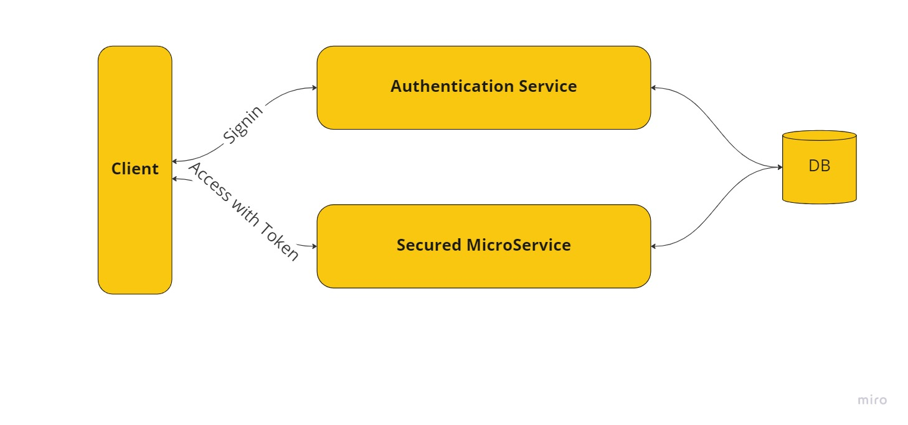


# [In Progress]

## Tech Stack

- [x] Vscode Extensions
- [x] Clean Architecture (Domain, Application, Infrastructure, Persistence)
- [x] CQRS (MediatR, Command, Query, Event, Middleware, Behaviour)
- [x] Rest Client
- [x] Authentication (Jwt)
- [x] Authorization (Role based/ Policy Based)
- [x] Options Pattern
- [x] User-secrets
- [x] Error handling
- [x] Mapster Mapper
- [x] Editor Config
- [x] Fluent Validation
- [x] Guard Clause
- [x] Fluent API
- [x] Logging (Serilog , Seq server)
- [x] EF Core (Seed, InMemory DB)
- [x] Specification Pattern
- [x] Security(Https, CORS)
- [x] Swagger / ApiConvention
- [x] Health Check
- [x] Caching
- [x] Debug vs in vscode
- [x] Unit Tests in vscode
- [x] Integration Test in vscode
- [x] Minimal APIs / Carter
- [x] GRPC Json Transcoding
- [] FastEndpoints
- [] Scrutor

# Vscode Extensions

- Sapphire Theme
- Nuget Reverse Package Search
- REST Client
- Roslynator
- .net core test explorer
- Auto-using for c#
- C# Namespace Autocompletion
- C# XML Documentation Comments
- Path Intellisense
- EditorConfig for VS Code
- SQL Server
- Gitlens
- vs browser
- JWT-Decoder
- VIM
- gRPC Clicker

// multiple editing ctrl+F, then alt+enter

# Clean Architecture


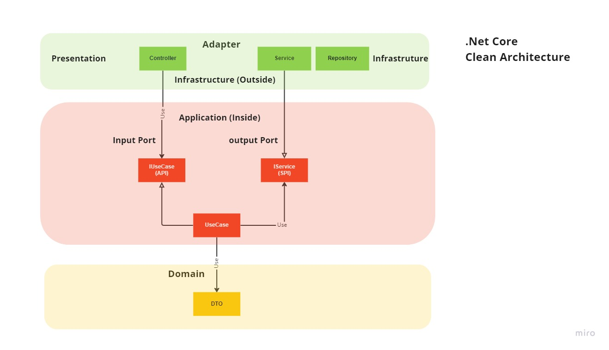

# Create solution

```dash
$ dotnet new sln -o ca-net7-simple-demo
$ cd ca-net7-simple-demo
```

# Create projects for clean architecture

```dash
$ dotnet new webapi -o Presentation.WebApi
$ dotnet new classlib -o Infrastructure
$ dotnet new classlib -o Application
$ dotnet new classlib -o Domain
```

# Add projects to sln

```dash
$ dotnet sln add (ls -r \*\*\*.csproj)

# build project
$ dotnet build

# restore package
$ dotnet restore
```

# Add reference to projects

## Dependency: Infrastruture/Presentation => Application => Domain

```dash
# Presentation => Application
# dotnet add *api reference *application
$ dotnet add .\Presentation.WebApi\ reference .\Application\

# Infrastructure => Application
$ dotnet add .\Infrastructure\ reference .\Application\

# Application => Domain
$ dotnet add .\Application\ reference .\Domain\

# Presentation => Application (Only for DI)
$ dotnet add .\Presentation.WebApi\ reference .\Infrastructure\
```

```dash
dotnet build
# run webapi and test by rest client
$ dotnet run --project .\Presentation.WebApi\

# run swagger
http://localhost:5106/swagger/index.html

```

# Create Rest Client


```dash
WeatherForecast.http

# @name WeatherForecast

GET {{host}} HTTP/1.1
content-type: application/json
```

# Add dependency injection package

```dash
$ dotnet add .\Application\ package Microsoft.Extensions.DependencyInjection.Abstractions

$ dotnet add .\Infrastructure\ package Microsoft.Extensions.DependencyInjection.Abstractions
```

# Add options pattern

The options pattern uses classes to provide strongly typed access to groups of related settings. When configuration settings are isolated by scenario into separate classes, the app adheres to two important software engineering principles.

```dash
using Microsoft.Extensions.Options;
```

# Add user-secrets

Secret Manager Tools

```dash
# Enable secret storage
$ dotnet user-secrets init --project .\Presentation.WebApi\
# Set a secret
$ dotnet user-secrets set --project .\Presentation.WebApi\ "JwtSettings:Secret" "super-secret-from-user-secret-key"
# List the secrets
$ dotnet user-secrets list --project .\Presentation.WebApi\
# Remove a single secret
$ dotnet user-secrets remove --project .\Presentation.WebApi\ "JwtSettings:Secret"
```

# Debug with create a new launch.json

- Generate assets for build and debug
- .Net Core attach


# Error Handler

1. Middleware
2. FilterAttribute
3. ErrorControler

# Launch webapi

```dash
$ dotnet watch run --project .\Presentation.WebApi\

```

# Swagger / ApiConvention

- Swagger
  http://localhost:5106/swagger

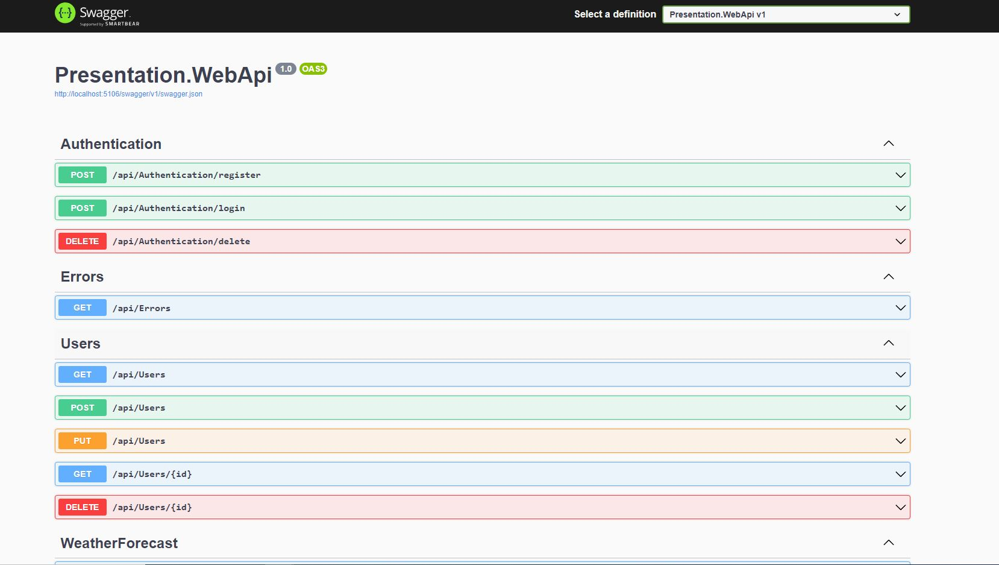

- Api Convention
  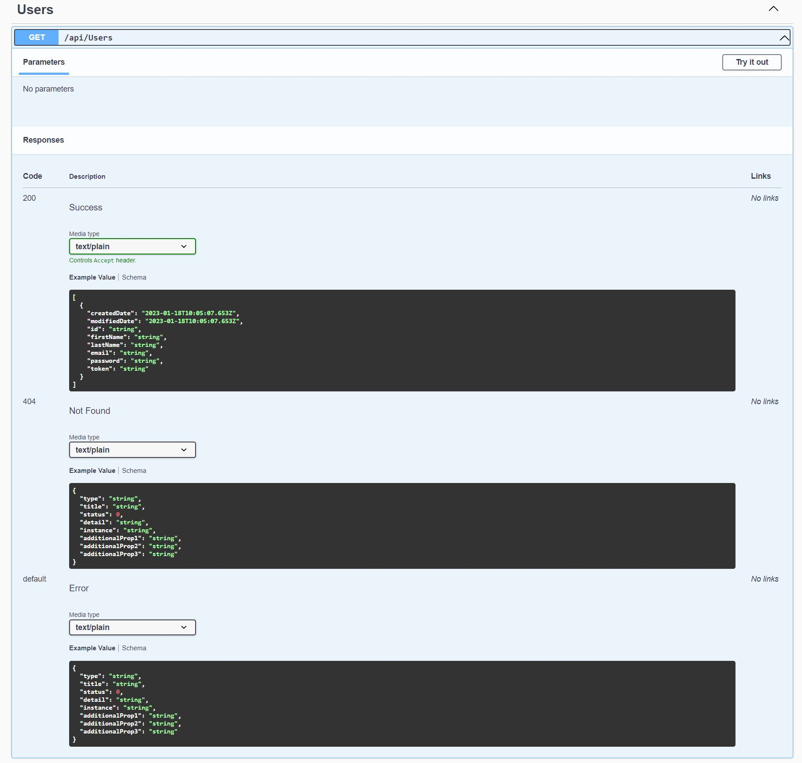

# CQRS and MediatR

```dash
$ dotnet add .\Application\ package MediatR
$ dotnet add .\Application\ package MediatR.Extensions.Microsoft.DependencyInjection
```

## CQRS Behaviour / Fluent validation / Logging

```dash
$ dotnet add .\Application\ package FluentValidation
$ dotnet add .\Application\ package FluentValidation.DependencyInjectionExtensions

$ dotnet add .\Application\ package AutoMapper.Extensions.Microsoft.DependencyInjection
```

## CQRS Event

- EmailNotification.cs

# Mapster Mapper

Mapster was designed to be efficient on both speed and memory. You could gain a 4x performance improvement whilst using only 1/3 of memory. And you could gain up to 12x faster performance with

```dash
$ dotnet add .\Presentation.WebApi\ package Mapster

$ dotnet add .\Application\ package Mapster
$ dotnet add .\Application\ package Mapster.DependencyInjection
```

# Error Handling

- ProblemDetails

  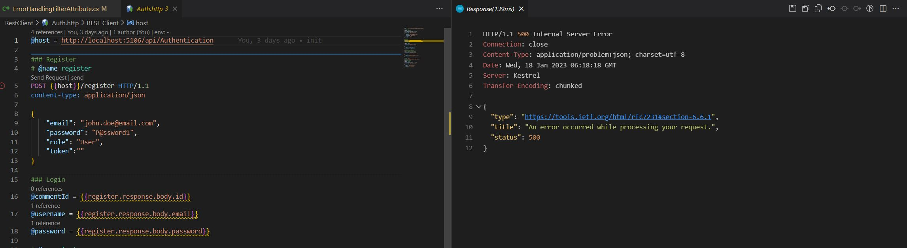

- ErrorOr

```dash
$ dotnet add .\Application\ package ErrorOr
```

# Authentication


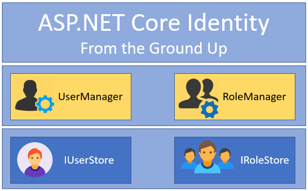

# JWT

JWTs consist of three parts separated by dots (.), which are:

## Header

{
'alg': 'HS256',
'typ': 'JWT'
}

## Payload

The second part of the token is the payload, which contains the claims. Claims are statements about an entity (typically, the user) and additional metadata. There are three types of claims: reserved, public, and private claims.

- Reserved claims: Some of them are: iss (issuer), exp (expiration time), sub (subject), aud (audience), among others.
  {
  'sub': '1234567890',
  'name': 'John Doe',
  'admin': true
  }

## Signature

To create the signature part you have to take the encoded header, the encoded payload, a secret, the algorithm specified in the header, and sign that.

HMACSHA256(
base64UrlEncode(header) + '.' +
base64UrlEncode(payload),
secret)

http://jwt.io

- browse to jwt.io where you can play with a JWT and put these concepts in practice. jwt.io allows you to decode, verify and generate JWT.

Whenever the user wants to access a protected route, it should send the JWT, typically in the Authorization header using the Bearer schema. Therefore the content of the header should look like the following.

Authorization: Bearer <token>

# JWT Bearer

- Add the Microsoft.AspNetCore.Authentication.JwtBearer NuGet package to project
- Specify a secret key in the appsettings.json file
- Specify authentication settings in the Program.cs file
- Create a user model.Need a class to store the login credentials of the user or users.
- Create an endpoint/service to generate JSON Web Tokens

```dash
# in order to validate Access Tokens, install JWTBearer
dotnet add .\Infrastructure\ package Microsoft.AspNetCore.Authentication.JwtBearer
```

# Authorization

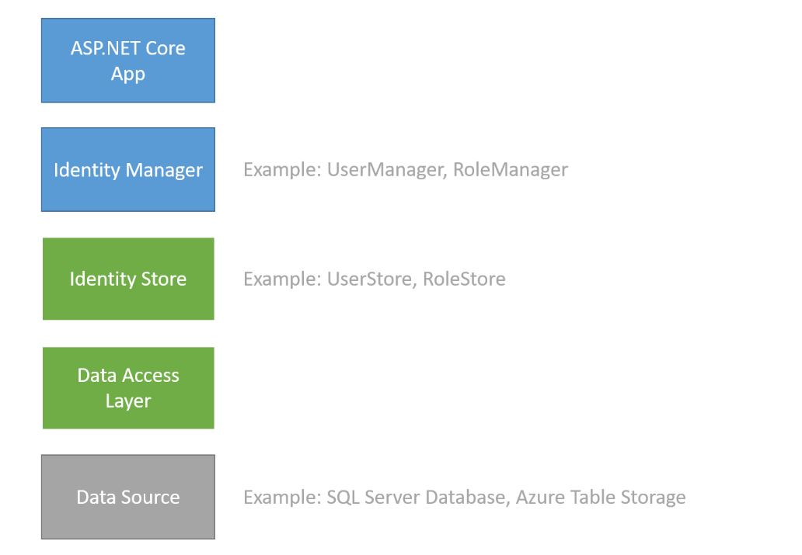

## Role-based Authorization

- Roles are exposed to the developer through the IsInRole method on the ClaimsPrincipal class.
- AddRoles must be added to Role services.
- Caching Role Information in a Cookie
- AuthorizationBehaviour.cs

```dash
$ dotnet add .\Infrastructure\ package Microsoft.AspNetCore.ApiAuthorization.IdentityServer
$ dotnet add .\Infrastructure\ package Microsoft.AspNetCore.Identity.EntityFrameworkCore
```

## Policy-based Authorization

- Use IAuthorizationService, [Authorize(Policy = "Something")], or RequireAuthorization("Something") for authorization.
- AuthorizationBehaviour.cs

# Editorconfig

With the editorconfig extension, VS Code will pick up basic formatting settings—such as spaces vs tabs and indent size—from standard .editorconfig files

```dash
$ dotnet new editorconfig
```

# EF Core

```dash
$ dotnet add .\Infrastructure\ package Microsoft.EntityFrameworkCore
$ dotnet add .\Infrastructure\ package Microsoft.EntityFrameworkCore.Design
$ dotnet add .\Infrastructure\ package Microsoft.EntityFrameworkCore.InMemory
$ dotnet add .\Infrastructure\ package Microsoft.EntityFrameworkCore.Tools
```

## Seed data

- DBGenerator

# Specification Pattern

Filter specifications
Sort specifications (e.g. OrderBy or OrderByDescending)
Group By clause
Related data specifications (i.e. Include)

Create a base ISpecifications interface
Create an Specifications class, which implements the interface. This class provides some basic implementation to specify filter conditions & sort conditions in a generic way.
SpecificationEvaluator to apply all expressions to IQueryable
Then if required, create concrete specification classes from Specifications. Otherwise, Specifications can be used.

# Guard Clauses

```dash
$ dotnet add .\Application\ package Ardalis.GuardClauses
$ dotnet add .\Infrastructure\ package Ardalis.GuardClauses
$ dotnet add .\Presentation.WebApi\ package Ardalis.GuardClauses
```

# BaseEntity / ValueObject / AggregateRoot /Record

- BaseEntity.cs

- Records add another way to define types. You use class definitions to create object-oriented hierarchies that focus on the responsibilities and behavior of objects. You create struct types for data structures that store data and are small enough to copy efficiently. You create record types when you want value-based equality and comparison, don't want to copy values, and want to use reference variables. You create record struct types when you want the features of records for a type that is small enough to copy efficiently.

# Fluent API

- A fluent API is a sequence of chained function calls, often arranged in a way that reads like an English sentence.

- Fluent API is a design pattern. The pattern was initially described by Martin Fowler in his article on Fluent Interface, and the main idea is to make code which is readable to ordinary written prose.

- The code build on the design Builder design pattern. And as the reader notice in the code example above make the code an extensive use of lambda expressions, which is quite normal for Fluent API .

# Logging - Serilog

```dash
$ dotnet add .\Presentation.WebApi\ package serilog.aspnetcore
$ dotnet add .\Presentation.WebApi\ package serilog.sinks.seq
$ dotnet add .\Presentation.WebApi\ package serilog.expressions
```

## Seq server


```dash
$ docker run --rm -it -e ACCEPT_EULA=y -p 5341:80 datalust/seq
```

## UML Diagram

```dash
$ dotnet tool install --global PlantUmlClassDiagramGenerator --version 1.2.4
$ puml-gen .\ generatedPuml -dir -execludePaths bin,obj,Properties -createAssociation -AllInOne
Then, Ctrl+Shift+P and select the PlanUml: Export Workspace Diagramsoption.
```

## Security

- Https
- CORS

## Caching

```dash
$ dotnet add .\Infrastructure\ package Microsoft.Extensions.Caching.Memory
```

## Health Check

```dash
$ dotnet add .\Presentation.WebApi\ package Microsoft.Extensions.Diagnostics.HealthChecks
$ dotnet add .\Infrastructure\ package Microsoft.Extensions.Diagnostics.HealthChecks
$ dotnet add .\Infrastructure\ package Microsoft.Extensions.Diagnostics.HealthChecks.EntityFrameworkCore

http://localhost:5106/health
```

## Unit Tests

- .net core test explorer
  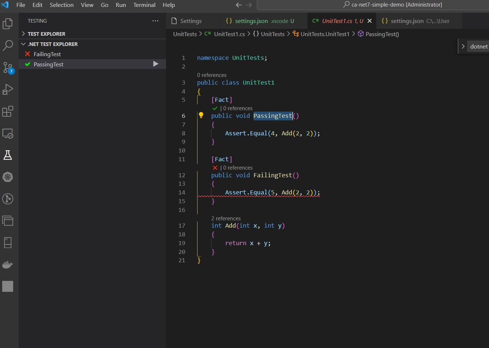

  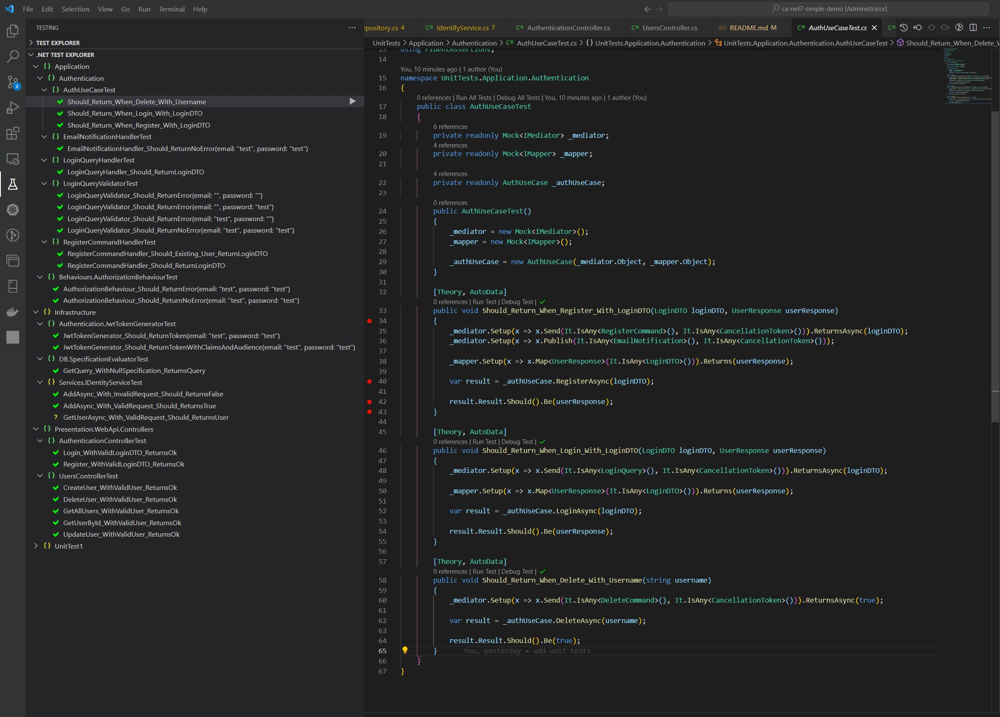

```dash
$ dotnet new xunit -o UnitTests

# Add to sln
$ dotnet sln add .\UnitTests\UnitTests.csproj

# reference to other projects
$ dotnet add .\UnitTests\ reference .\Presentation.WebApi\
$ dotnet add .\UnitTests\ reference .\Application\
$ dotnet add .\UnitTests\ reference .\Domain\
$ dotnet add .\UnitTests\ reference .\Infrastructure\

$ dotnet test

# Moq
$ dotnet add .\UnitTests\ package Moq

# FluentAssertion
$ dotnet add .\UnitTests\ package FluentAssertions

# AutoFixture
$ dotnet add .\UnitTests\ package AutoFixture
$ dotnet add .\UnitTests\ package AutoFixture.AutoMoq
$ dotnet add .\UnitTests\ package AutoFixture.Xunit2
```

## Integration Test

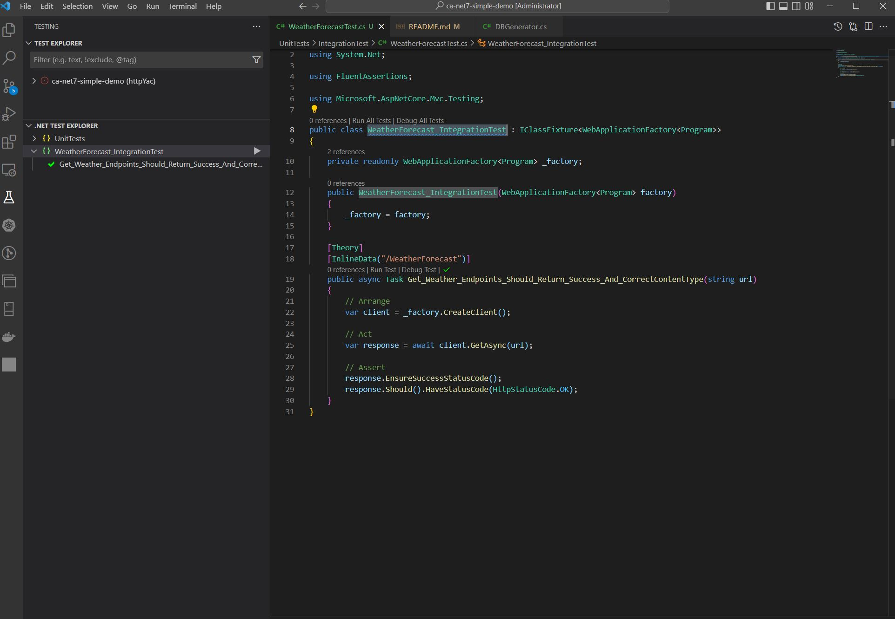

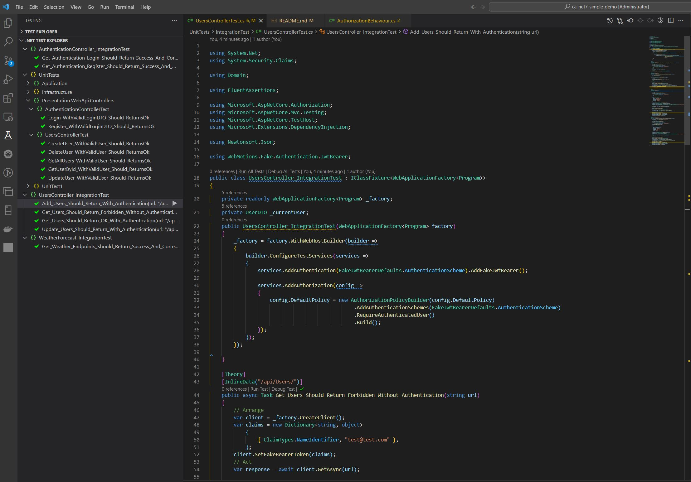

```dash
# TestServer
$ dotnet add .\UnitTests\ package Microsoft.AspNetCore.TestHost

# WebApplicationFactory (bootstap TestServer)
$ dotnet add .\UnitTests\ package Microsoft.AspNetCore.Mvc.Testing

# Fake Authentication
$ dotnet add .\UnitTests\ package WebMotions.Fake.Authentication.JwtBearer
```

## Minimal API / Carter

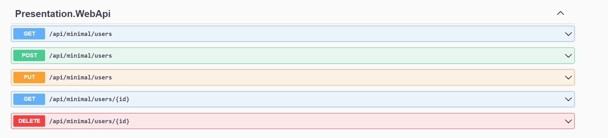

http://localhost:5106/api/minimal/Users

```dash
$ dotnet add .\Presentation.WebApi\ package MinimalApi.Endpoint

$ dotnet add .\Presentation.WebApi\ package carter
```

## Grpc Json Transcoding

```dash
# create grpc project
$ dotnet new grpc -o Presentation.Grpc

# add project to sln
$ dotnet sln add .\Presentation.Grpc\Presentation.Grpc.csproj

# reference to application & infrastructure
$ dotnet add .\Presentation.Grpc\ reference .\Application\
$ dotnet add .\Presentation.Grpc\ reference .\Infrastructure\

# add grpc package
$ dotnet add .\Presentation.Grpc\ package Grpc.AspNetCore.Server.Reflection
$ dotnet add .\Presentation.Grpc\ package Microsoft.AspNetCore.Grpc.JsonTranscoding
$ dotnet add .\Presentation.Grpc\ package Microsoft.AspNetCore.Grpc.Swagger

# add other packages, please follow with Presentation.WebApi.csproj

# proto schema
./Protos

# Grpc.client
$ dotnet add .\Grpc.Client\ package Google.Protobuf
$ dotnet add .\Grpc.Client\ package Grpc.Net.ClientFactory
$ dotnet add .\Grpc.Client\ package Grpc.Tools

# run gRPC server project
$ dotnet watch run --project .\Presentation.Grpc\

# run gRPC Client project (for test only)
$ dotnet watch run --project .\Grpc.Client\
```

## gRPC JSON Transcoding

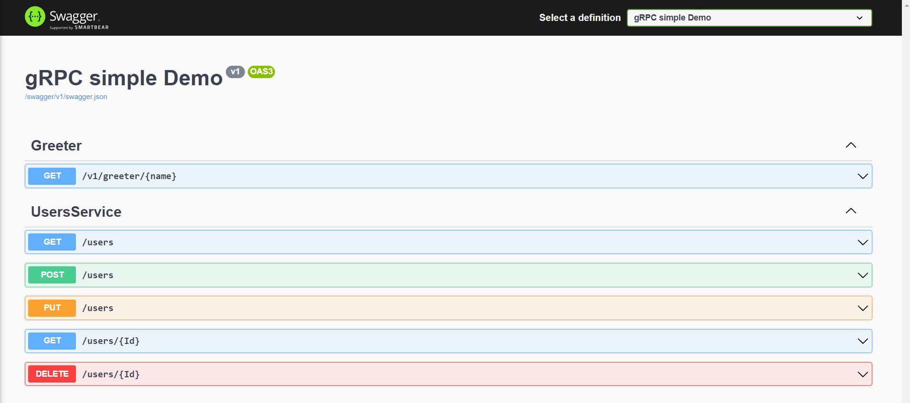

## gRPC Clicker

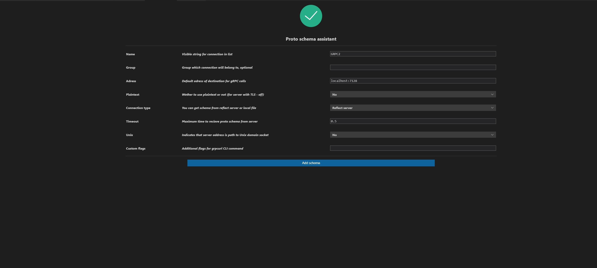

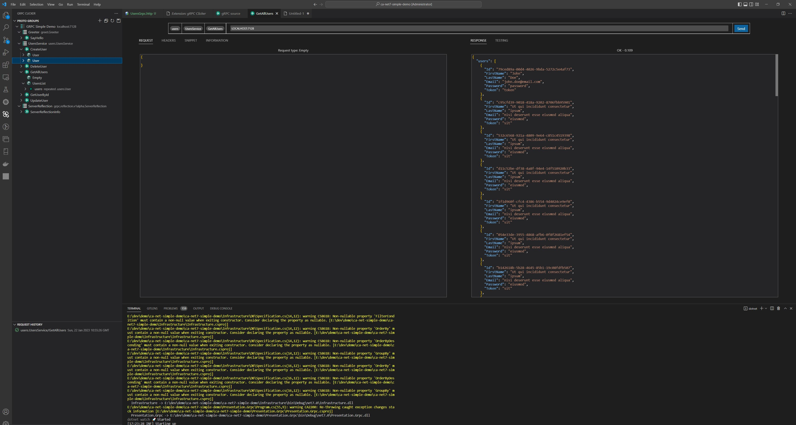

# TODO

- FastEndpoints
